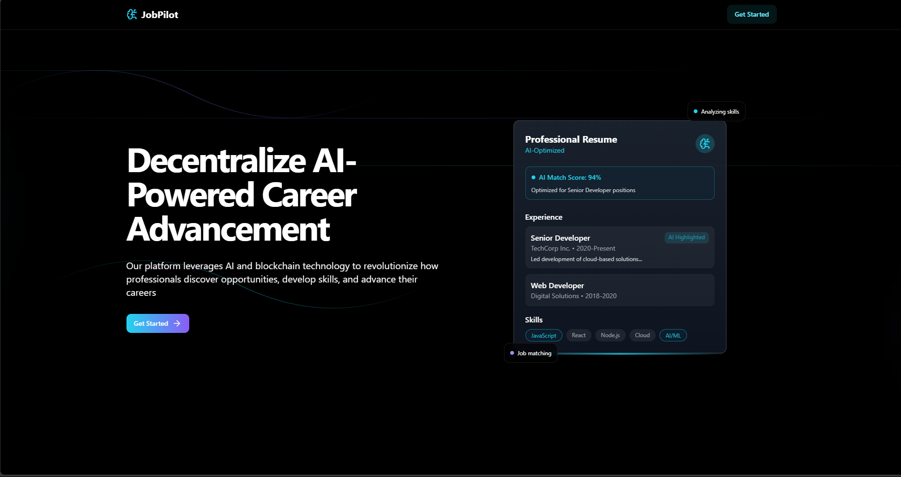
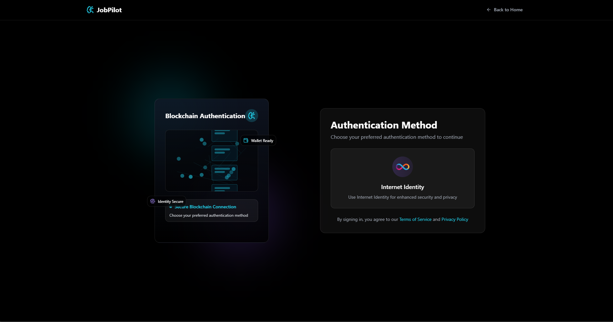
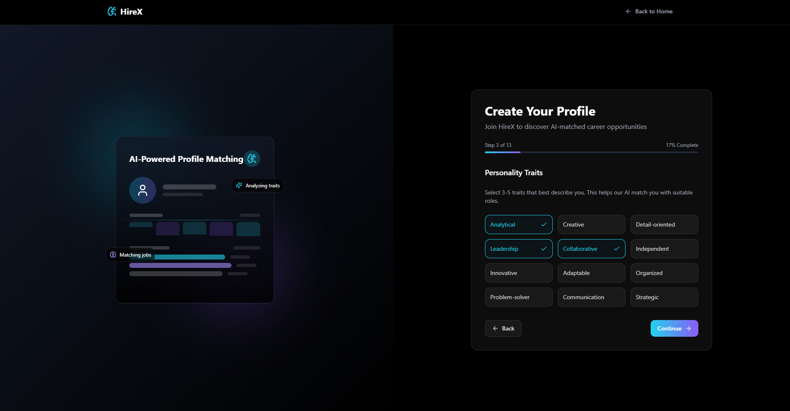
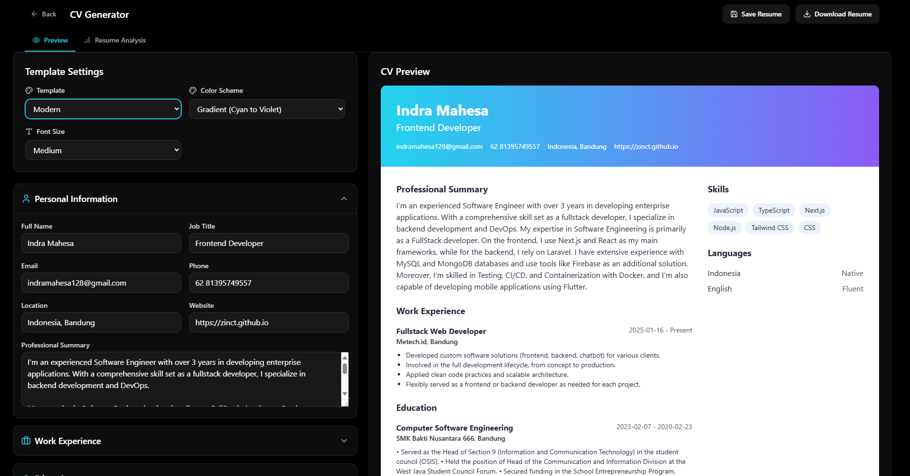
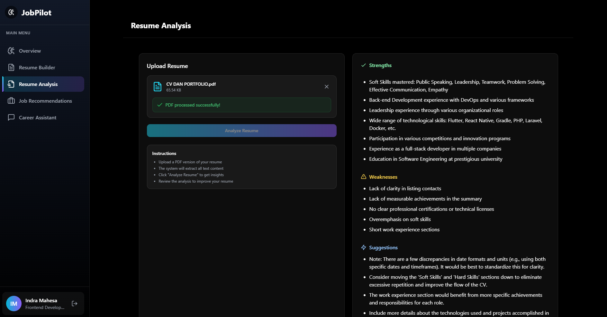
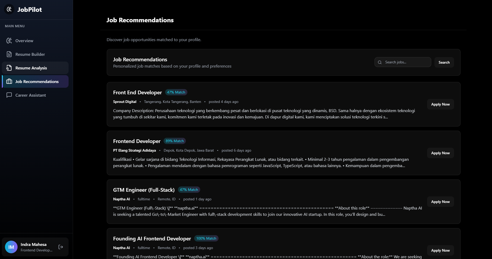
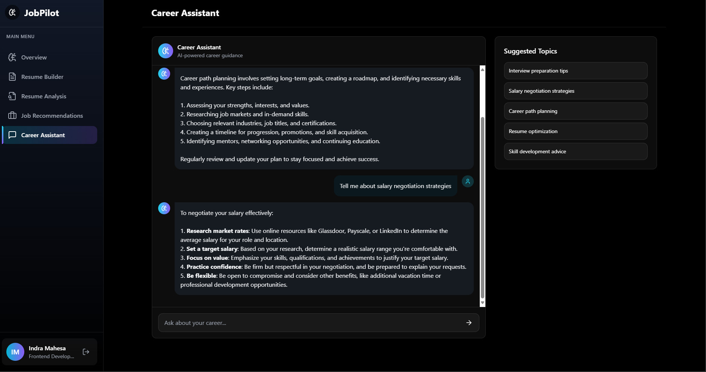

# 🚀 JobPilot

<br />
<div align="center">
  <a href="https://github.com/zinct/jobpilot">
    
  </a>
  <h3 align="center">JobPilot - Decentralize AI-Powered Career Advancement</h3>
  <p align="center">
    Our platform leverages AI and blockchain technology to revolutionize how professionals discover opportunities, develop skills, and advance their careers.
  </p>
</div>

## 📌 Why JobPilot?

In today's competitive job market, standing out is crucial. JobPilot revolutionizes the way job seekers build, analyze, and optimize their resumes with the power of blockchain and AI. Unlike traditional platforms, JobPilot ensures full on-chain data security, providing transparency and trust like never before. Whether you're a fresh graduate or a seasoned professional, JobPilot helps you craft the perfect resume and find the right job—seamlessly.

## 🌟 Features of JobPilot?

### AI-Powered Resume Builder (Fully On-Chain)

- Choose from multiple professionally designed templates.
- Easily customize your resume to fit your needs.
- All resumes are securely stored on-chain for authenticity and integrity.

### AI Resume Analysis (Fully On-Chain)

- Get in-depth insights into your resume using AI.
- Identify strengths and areas for improvement.
- Ensure your resume aligns with job market trends—all fully on-chain.

### Personalized Job Recommendations (HTTP Outcalls)

- Receive job recommendations based on your personal data at registration.
- Jobs are matched in real-time using blockchain technology for trust and accuracy.
- JobPilot provides a match score (0 - 100%) based on personality data analyzed by AI.

### AI Career Assistant (Fully On-Chain)

- Get personalized career advice powered by AI.
- AI helps optimize your resume and job search strategy.
- Fully on-chain, ensuring transparency and data integrity.

## 🏆 What We Are Proud Of

- We have successfully deployed AI-driven resume analysis on the Internet Computer Protocol (ICP)
- With HTTP Outcalls, JobPilot can securely interact with external data sources
- We have integrated Internet Identity (II) for secure and user-friendly authentication.

## Getting Started

### 🔧 Clone the repository:

```sh
git clone https://github.com/zinct/jobpilot.git
```

### 📦 Install Dependencies:

```sh
cd jobpilot
npm install
```

### 🛠 Deployment Options:

- Deploy on Local

  ```sh
   dfx start --clean
   dfx deploy
  ```

  ⚠️ Note: AI-powered resume analysis and AI Career Assistant will not work on local deployments. To use this feature, deploy to the Playground.

- Deploy on Playground
  ```sh
   dfx deploy --playground
  ```
  ⚠️ Note: Job recommendations using HTTP Outcalls require a local deployment due to cycle limitations on the Playground.

## Demo App

| Jobpilot Landing Page          | Login to jobpilot            |
| ------------------------------ | ---------------------------- |
|  |  |

| Register to jobpilot            | Resume Builder                 |
| ------------------------------- | ------------------------------ |
|  |  |

| AI Resume Analysis              | AI Jobs Recommendation      |
| ------------------------------- | --------------------------- |
|  |  |

| AI Career Assistant              |
| -------------------------------- |
|  |

## Created by Motionlab Team

- Indra Mahesa (Developer)
- Audri Mona Najogi (UI/UX Designer)
- Wildan Syukri Niam (Developer)
- Reinhard Efraim Situmeang (Developer)
- Aaron Joseph (Developer)
